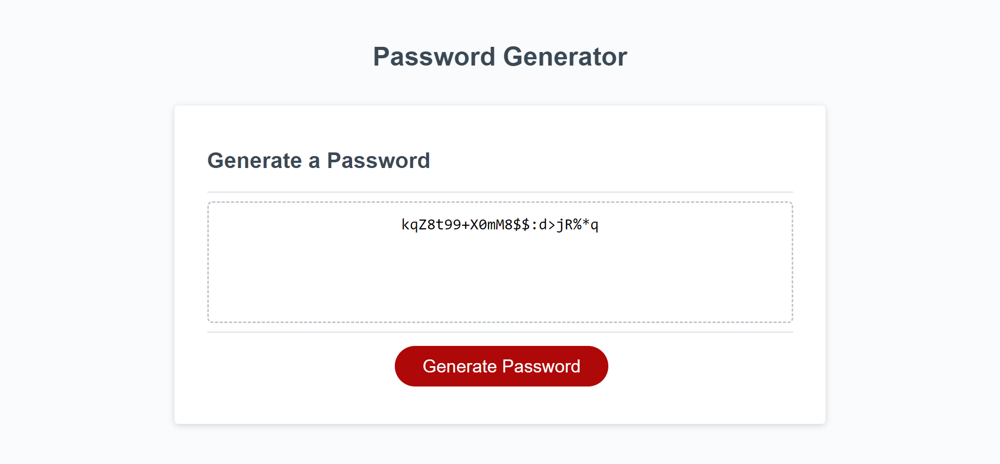

# JavaScript Password Generator

## Description

The aim of this project was to create a fully functional password generator using Javascript. The password generator contains criteria prompts for the password length, and the various character types that can be included in the password such as uppercase and lowercase characters, numbers, and special characters. 

The starter code contained the HTML, CSS, and a small amount of JavaScript code. As a result this project solely focused on creating JavaScript code.

The Javascript features used to create this project consisted of:
- Variables
- Primitive types - mostly strings
- Conditional 'if' statements 
- Arrays 
- Iteration and 'for' loops
- Functions 
- Methods
- Prompts and Alerts

The deployed application can be viewed through this link - 
## Installation

N/A

## Usage

To use the password generator simply click the red 'Generate Password' button. A prompt will appear that asks you to specify how many characters you would like in your password - this needs to be between 8 and 128 characters. If your input does not meet this criteria due to the number not being within the length range or not being a number at all, a corresponding prompt will appear to alert you to change your input and why. You will then be looped back to the first prompt.

Once a valid character length has been entered, click the 'OK' button and another prompt will appear asking you if you want uppercase characters in your password. Click 'OK' for yes and 'Cancel' for no. This same process will repeat for lowercase characters, special characters and numbers. You must click 'OK' to at least one of these criteria. If you don't, an alert will appear asking you to do so, looping you back round to the uppercase prompt question. 

Once this is completed, the password generator will create a random password that fits your criteria.

## Credits

N/A

## License

N/A

